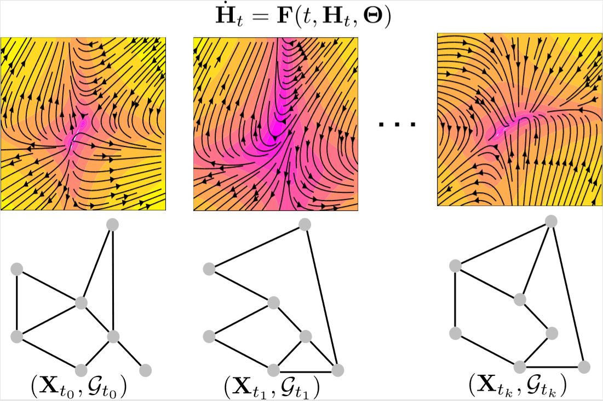

# gde
Graph Neural Ordinary Differential Equations

```We introduce the framework of continuous-depth graph neural networks (GNNs). Graph neural ordinary differential equations (GDEs) are formalized as the counterpart to GNNs where the input-output relationship is determined by a continuum of GNN layers, blending discrete topological structures and differential equations. The proposed framework is shown to be compatible with various static and autoregressive GNN models. Results prove general effectiveness of GDEs: in static settings they offer computational advantages by incorporating numerical methods in their forward pass; in dynamic settings, on the other hand, they are shown to improve performance by exploiting the geometry of the underlying dynamics.```

paper: [arXiv link](https://arxiv.org/abs/1911.07532)

<p align="center"> 

</p>

This repository is a work in progress. It contains examples of *Graph neural ordinary Differential Equations* (**GDE**) applied to different tasks. Several documented tutorial notebooks will be included: these notebooks are designed to be clear and useful to practicioners and researchers at all levels of familiarity with *graph neural networks* (GNNs) and *neural ordinary differential equations*. The notebooks contain abundant amounts of comments and all runnable top-to-bottom.

GDEs rely on [dgl](https://github.com/dmlc/dgl) and [torchdiffeq](https://github.com/rtqichen/torchdiffeq).

NOTE: GDE model zoo and tutorials are now moved to the `torchdyn` library: [link](https://github.com/DiffEqML/torchdyn)

To suggest/request additional applications or GDE models, raise an `Issue` or contact me via email.
If you find our work useful, consider citing us:

```
@article{poli2019graph,
  title={Graph Neural Ordinary Differential Equations},
  author={Poli, Michael and Massaroli, Stefano and Park, Junyoung and Yamashita, Atsushi and Asama, Hajime and Park, Jinkyoo},
  journal={arXiv preprint arXiv:1911.07532},
  year={2019}
}
```
